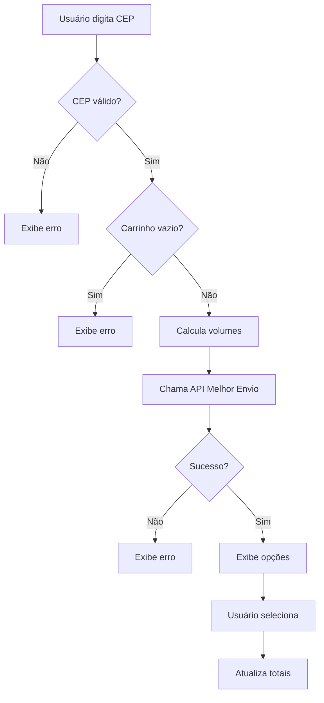
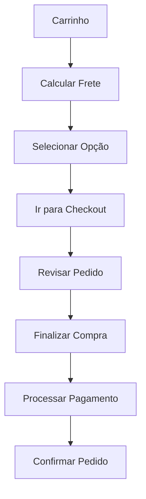

# Sistema de Cálculo de Frete - VueShop

## 📦 Visão Geral

Este documento descreve a implementação completa do sistema de cálculo de frete integrado com o Melhor Envio no VueShop.

## 🛠️ Arquivos Implementados

### 1. Composable de Frete
**Arquivo:** `vueshop-starter/src/composables/useShipping.js`

**Funcionalidades:**
- ✅ Estado global do frete (opções, seleção, loading)
- ✅ Formatação automática de CEP (XXXXX-XXX)
- ✅ Validação de CEP
- ✅ Cálculo de volumes baseado no carrinho
- ✅ Integração com API do Melhor Envio
- ✅ Seleção de opções de frete
- ✅ Simulação de frete para desenvolvimento
- ✅ Tratamento de erros completo

**Métodos Principais:**
```javascript
// Formatação e validação
formatCep(cep)
validateCep(cep)

// Cálculo de frete
calcularFrete(cartItems, cepDestino)
simulateShipping(cepDestino)

// Seleção e limpeza
selectShipping(option)
clearShipping()
```

### 2. Componente Reutilizável
**Arquivo:** `vueshop-starter/src/components/ShippingCalculator.vue`

**Características:**
- ✅ Componente standalone para cálculo de frete
- ✅ Props configuráveis (cartItems, showSimulation, showSummary)
- ✅ Eventos customizados (shipping-selected, shipping-calculated)
- ✅ Interface responsiva com Tailwind CSS
- ✅ Estados visuais (loading, selecionado, erro)

**Uso:**
```vue
<ShippingCalculator 
  :cart-items="cartItems"
  :show-simulation="true"
  @shipping-selected="onShippingSelected"
  @shipping-calculated="onShippingCalculated"
/>
```

### 3. View de Checkout
**Arquivo:** `vueshop-starter/src/views/CheckoutView.vue`

**Funcionalidades:**
- ✅ Página completa de finalização de compra
- ✅ Revisão de itens do carrinho
- ✅ Cálculo de frete integrado
- ✅ Resumo de totais (subtotal + frete)
- ✅ Validações e proteções de rota
- ✅ Interface moderna e responsiva

### 4. CartView Atualizado
**Arquivo:** `vueshop-starter/src/views/CartView.vue`

**Melhorias:**
- ✅ Integração com composable useShipping
- ✅ Código limpo e organizado
- ✅ Navegação para checkout
- ✅ Remoção de código duplicado

### 5. Rotas Atualizadas
**Arquivo:** `vueshop-starter/src/router/index.js`

**Novas Rotas:**
```javascript
{
  path: "/checkout",
  name: "Checkout",
  component: CheckoutView,
  meta: { requiresAuth: true }
}
```

## 🔄 Fluxo de Funcionamento

### 1. Cálculo de Frete


### 2. Fluxo de Checkout


## 🎨 Interface de Usuário

### Componentes Visuais
- **Input CEP**: Formatação automática XXXXX-XXX
- **Botão Calcular**: Loading spinner durante cálculo
- **Opções de Frete**: Cards selecionáveis com rádio buttons
- **Resumo**: Totais claramente exibidos
- **Estados**: Loading, erro, sucesso, vazio

### Responsividade
- Mobile-first design
- Grid layouts responsivos
- Componentes adaptativos
- Touch-friendly buttons

## 🔧 Configurações

### Variáveis de Ambiente
```bash
# Melhor Envio
MELHOR_ENVIO_CLIENT_ID=your_client_id
MELHOR_ENVIO_CLIENT_SECRET=your_client_secret
MELHOR_ENVIO_SANDBOX=true
```

### CEP de Origem
Por padrão configurado para São Paulo/SP: `01001000`
Pode ser alterado no composable `useShipping.js` ou via configuração.

## 📱 Funcionalidades Desenvolvidas

### ✅ Implementado
- [x] Composable de frete completo
- [x] Componente reutilizável
- [x] View de checkout
- [x] Integração com carrinho
- [x] Formatação de CEP
- [x] Validações
- [x] Tratamento de erros
- [x] Interface responsiva
- [x] Estados de loading
- [x] Simulação para desenvolvimento

### 🔄 Para Futuras Melhorias
- [ ] Cache de cálculos de frete
- [ ] Histórico de CEPs
- [ ] Integração com endereços salvos
- [ ] Cálculo de prazo de entrega
- [ ] Notificações de rastreamento
- [ ] Múltiplos endereços de entrega

## 🧪 Como Testar

### 1. Desenvolvimento
```bash
# Usar simulação de frete
# No ShippingCalculator, ativar showSimulation=true
```

### 2. Integração Real
```bash
# Configurar credenciais do Melhor Envio
# Testar com CEPs reais
# Verificar logs no browser console
```

### 3. CEPs de Teste
- **São Paulo/SP**: 01001-000
- **Rio de Janeiro/RJ**: 20040-020
- **Belo Horizonte/MG**: 30112-000

## 📞 Suporte e Documentação

### Links Úteis
- [Documentação Melhor Envio](https://docs.melhorenvio.com.br/)
- [API Reference](https://docs.melhorenvio.com.br/reference)
- [Sandbox](https://sandbox.melhorenvio.com.br/)

### Logs e Debug
O sistema inclui logs detalhados no console:
- 🚚 Cálculo de frete
- 📦 Payload enviado
- 📥 Resposta da API
- ✅ Sucesso/Erro

---

**Data de Implementação:** Dezembro 2024  
**Versão:** 1.0  
**Status:** ✅ Funcional 
