# 🚚 **Solução para Erro "Sandbox token não encontrado"**

## ❌ **Problema**
Você está vendo este erro nos logs:
```
Sandbox token não encontrado. Faça /api/shipping/connect antes.
```

## ✅ **Solução Rápida**

### **Passo 1: Acesse as Configurações**
1. Abra o frontend: `http://localhost:5173` (ou sua URL do Vue)
2. Navegue para: **http://localhost:5173/config**
3. Ou adicione `/config` na URL

### **Passo 2: Configure o Melhor Envio**
1. Na página de configurações, localize "**Integração de Frete**"
2. Clique em "**Conectar com Melhor Envio**"
3. Uma janela popup será aberta
4. Complete o processo de autenticação OAuth

### **Passo 3: Teste o Cálculo de Frete**
1. Após conectar, volte ao carrinho
2. Tente calcular o frete novamente
3. Agora deve funcionar normalmente

## 🔧 **Solução Alternativa (Manual)**

Se preferir fazer manualmente via browser:

### **Conectar via URL Direta:**
```
PS C:\Users\dj_al\Desktop\vue\vueshop-starter> npm run dev

> vueshop-starter@0.0.0 dev
> vite


  VITE v5.4.19  ready in 1748 ms

  ➜  Local:   http://localhost:5173/
  ➜  Network: use --host to expose
  ➜  press h + enter to show help
01:27:12 [vite] Pre-transform error: [vue/compiler-sfc] This experimental syntax requires enabling one of the following parser plugin(s): "jsx", "flow", "typescript". (98:0)

C:/Users/dj_al/Desktop/vue/vueshop-starter/src/components/MelhorEnvioConnect.vue
174|  }
175|
176|  onMounted(() => {
   |                     ^
177|  <template>
   |  ^
178|    <div class="bg-white rounded-lg shadow-lg p-6">
01:27:13 [vite] Internal server error: [vue/compiler-sfc] This experimental syntax requires enabling one of the following parser plugin(s): "jsx", "flow", "typescript". (98:0)

C:/Users/dj_al/Desktop/vue/vueshop-starter/src/components/MelhorEnvioConnect.vue
174|  }
175|
176|  onMounted(() => {
   |                     ^
177|  <template>
   |  ^
178|    <div class="bg-white rounded-lg shadow-lg p-6">
  Plugin: vite:vue
  File: C:/Users/dj_al/Desktop/vue/vueshop-starter/src/components/MelhorEnvioConnect.vue:98:0
  58 |            @click="reconnect"
  59 |            :disabled="connecting"
  60 |            class="flex-1 bg-gray-600 hover:bg-gray-700 disabled:bg-gray-400 text-white font-medium py-2 px-4 rounded-md transition-colors"
     |                                                                                                             ^
  61 |          >
  62 |            Reconectar
      at constructor (C:\Users\dj_al\Desktop\vue\vueshop-starter\node_modules\@babel\parser\lib\index.js:363:19)
      at Parser.raise (C:\Users\dj_al\Desktop\vue\vueshop-starter\node_modules\@babel\parser\lib\index.js:6609:19)
      at Parser.expectOnePlugin (C:\Users\dj_al\Desktop\vue\vueshop-starter\node_modules\@babel\parser\lib\index.js:6643:18)
      at Parser.parseExprAtom (C:\Users\dj_al\Desktop\vue\vueshop-starter\node_modules\@babel\parser\lib\index.js:11330:18)
      at Parser.parseExprSubscripts (C:\Users\dj_al\Desktop\vue\vueshop-starter\node_modules\@babel\parser\lib\index.js:11012:23)
      at Parser.parseUpdate (C:\Users\dj_al\Desktop\vue\vueshop-starter\node_modules\@babel\parser\lib\index.js:10997:21)
      at Parser.parseMaybeUnary (C:\Users\dj_al\Desktop\vue\vueshop-starter\node_modules\@babel\parser\lib\index.js:10977:23)
      at Parser.parseMaybeUnaryOrPrivate (C:\Users\dj_al\Desktop\vue\vueshop-starter\node_modules\@babel\parser\lib\index.js:10830:61)
      at Parser.parseExprOps (C:\Users\dj_al\Desktop\vue\vueshop-starter\node_modules\@babel\parser\lib\index.js:10835:23)
      at Parser.parseMaybeConditional (C:\Users\dj_al\Desktop\vue\vueshop-starter\node_modules\@babel\parser\lib\index.js:10812:23)
```

### **Verificar Status:**
```
https://vueshopfim.test/api/shipping/debug
```

## 🐛 **Debugging**

### **Ver Logs em Tempo Real:**
```bash
# No terminal do Laravel
tail -f storage/logs/laravel.log
```

### **Verificar Configuração:**
```bash
# Verificar se as variáveis estão definidas
cat .env | grep MELHOR_ENVIO
```

## 📋 **Checklist de Verificação**

- [ ] Frontend rodando em `http://localhost:5173`
- [ ] Backend rodando em `https://vueshopfim.test`
- [ ] Usuário logado no sistema
- [ ] Acesso à página `/config` funcionando
- [ ] Popup de OAuth não bloqueado pelo browser

## 🔄 **Fluxo Completo**

```mermaid
graph TD
    A[Acessar /config] --> B[Clicar 'Conectar Melhor Envio']
    B --> C[Popup OAuth Abre]
    C --> D[Autorizar Aplicação]
    D --> E[Token Salvo no Cache]
    E --> F[Voltar ao Carrinho]
    F --> G[Calcular Frete]
    G --> H[✅ Sucesso!]
```



## 🆘 **Se Ainda Não Funcionar**

### **1. Limpar Cache do Laravel:**
```bash
php artisan cache:clear
php artisan config:clear
```

### **2. Verificar Credenciais no .env:**
```bash
MELHOR_ENVIO_CLIENT_ID=seu_client_id
MELHOR_ENVIO_CLIENT_SECRET=seu_client_secret  
MELHOR_ENVIO_SANDBOX=true
```

### **3. Verificar URLs de Callback:**
- No painel Melhor Envio deve estar: `https://vueshopfim.test/auth/melhorenvio/callback`
- No Laravel deve estar configurado igual

## 📞 **Links Úteis**

- **Frontend Configurações**: http://localhost:5173/config
- **Conectar Melhor Envio**: https://vueshopfim.test/shipping/connect
- **Debug API**: https://vueshopfim.test/api/shipping/debug
- **Painel Melhor Envio**: https://sandbox.melhorenvio.com.br/

---

**🎯 Resultado Esperado:** Após seguir estes passos, o cálculo de frete deve funcionar normalmente sem mais erros nos logs. 
